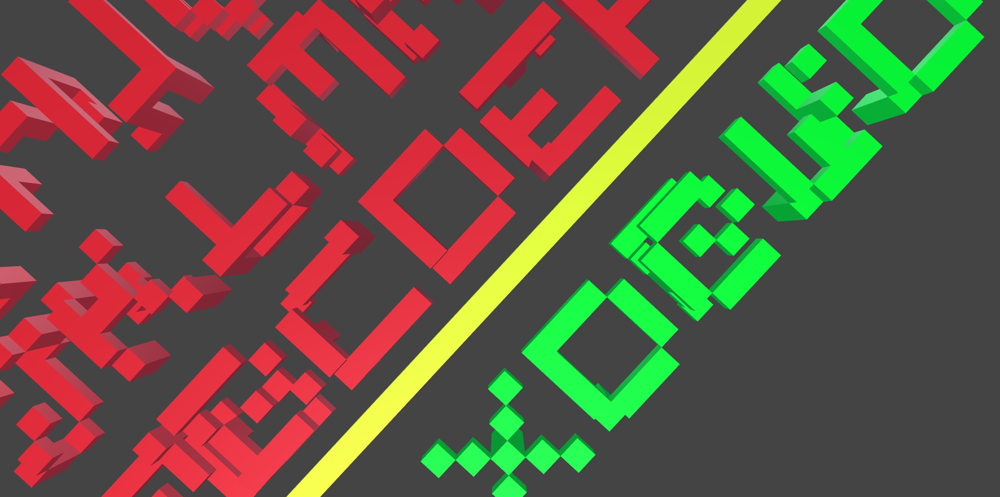

# Alphabet



```
/*
https://www.flickr.com/photos/33807726@N02/3280335261
*/

#define letter_space 6
#define line_space 7

//underline + phrase
1 * {x -102 z -1} 55 * {x 1 color #FF0} box
phrase
{x 102 z -9 color #0F0} random_letters


rule phrase {
Line1
{ z line_space } Line2
{ z 14 } Line3
}


rule Line1 {
{ x 0 } AA
{ x letter_space } BB
{ x 12 } CC
{ x 18 } DD
{ x 24 } EE
{ x 30 } FF
{ x 36 } GG
{ x 42 } HH
{ x 48 } II
}

rule Line2 {
{ x 0 } JJ
{ x letter_space } KK
{ x 12 } LL
{ x 18 } MM
{ x 24 } NN
{ x 30 } OO
{ x 36 } PP
{ x 42 } QQ
{ x 48 } RR
}

rule Line3 {
{ x 0 } SS
{ x letter_space } TT
{ x 12 } UU
{ x 18 } VV
{ x 24 } WW
{ x 30 } XX
{ x 36 } YY
{ x 42 } ZZ
}

rule random_letters {
letter
{x 6 } letter
{x 12 } letter
{x 18 } letter
{x 24 } letter
}


//------------------------------------
// Core alphabet section
// Each Letter is a transformed version of
// a letter group block
rule AA { ACEMW }
rule BB {{z 1 y 5 rx 90} QKB }
rule CC {{z 5 y 5 x 4 ry 180 rx 90} ACEMW }
rule DD { DL }
rule EE {{z 5 x 5 ry -90 rz 90} ACEMW }
rule FF {{z 5 x 5 rz 90 rx -90} YTF }
rule GG { SGUC }
rule HH { HNZIR }
rule II {{ x -1 z 5 ry 90} HNZIR }
rule JJ {{z 5 y -1 rx -90 } OJ }
rule KK {{z 6 x 0 ry 180 rz 90 } QKB }
rule LL {{z 1 y 5 rx 90 } DL }
rule MM {{y 4 rz -90} ACEMW }
rule NN {{z 1 y 5 rx 90} HNZIR }
rule OO { OJ }
rule PP { PV }
rule QQ { QKB }
rule RR {{z 6 ry 180 rz 90} HNZIR }
rule SS {{z 1 y 5 rx 90} SGUC }
rule TT {{x 4 z 5 y 5 ry 180 rx 90} YTF } // DT also
rule UU {{z 6 ry 180 rz 90} SGUC }
rule VV {{z 5 x 0 y -1 rx -90} PV }
rule WW {{x 4 z 6 y 4 ry 180 rz -90} ACEMW }
rule XX { XT }
rule YY {{x 4 z 6 ry 180} YTF }
rule ZZ {{z 5 y 5 ry 90 rx 90} HNZIR }

//------------------------------------
// Letter Block rules
// Each letter is made of lines of blocks
rule ACEMW {
{x 0 } line_31
{x 1 } line_4
{x 2 } line_4
{x 3 } line_4
{x 4 } line_1
{y 1 x 4} line_16 // C
{y 2 x 4} line_28
{y 3 x 4} line_16
{y 4 x 4} line_15
{y 4 x -1 z 5 ry 90} line_15 // E
}

rule YTF {
{x 0 } line_7
{x 1 } line_4
{x 2 } line_8
{x 3 } line_4
{x 4 } line_7
{x 2 y 5 z 5 rx 90} line_31 //T
{x 2 y 2 } line_12 //F
}

rule SGUC {
{x 0 } line_15
{x -1 y 0 z 5 ry 90} line_1
{x 4 } line_6
{x 3 } line_4
{x 0 y 0 z 1 ry 90} line_15
{x 4 y 1} line_16 // S
{x -1 y 2 z 5 ry 90} line_31
{x 0 y 3} line_16
{x -1 y 4 z 5 ry 90} line_31
{x 0 y 4 } line_15 // C
}

rule PV {
{x 0 } line_11
{x 4} line_8
{x 0 y 1} line_20
{x 0 y 2} line_20
{x 4 y 1} line_20
{x 4 y 2} line_20
{x 1 y 3} line_20
{x 3 y 3} line_20
{x 2 y 4} line_20
}

rule HNZIR {
{x 0 } line_16
{x 4 } line_31
{x 3 y 1} line_4
{x 2 y 2} line_4
{x 1 y 3} line_4
{x 0 y 3 } line_4
{x 4 y 5 z 3 rx 90} line_14
{x 0 y 5 z 1 rx 90} line_14
{x 0 y 4} line_2
{x 0 y 3} line_8
{x 4 y 4} line_16
}

rule QKB {
{x 0 } line_14
{x 1 } line_17
{x 2 } line_17
{x 3 } line_17
{x 0 y 3} line_9
{x 0 y 2} line_6
{x 0 y 1} line_4
{x -1 y 4 z 5 ry 90} line_15
{x 4 y 3} line_8
{x 3 y 2} line_2
{x 4 y 1} line_4
{x 2 y 2} line_4
}

rule OJ {
{x 0 } line_14
{x 1 } line_1
{x 2 } line_16
{x 3 } line_17
{x 4 } line_14
{x 2 y 1} line_16
{x 2 y 2} line_16
{x 2 y 3} line_17
{x 0 y 4} line_14
{x 1 y 4} line_17
}

rule DL {
{x 0 } line_30
{x 1 } line_17
{x 2 } line_17
{x 3 } line_17
{x 4 } line_14
{x 0 y 5 z 1 rx 90} line_15
}

rule XT {
{x 0 } line_17
{x 4 } line_17
{x 1 } line_10
{x 3 } line_10
{x 2 y 5 z 3 rx 90} line_31
}

//------------------------------------
// Line rules (minimal set required by blocks)
// each line_id refers to its binary representation
rule line_1 { {z 1 } drawbox }
rule line_2 { {z 2 } drawbox }
rule line_3 { line_1 {z 2 } drawbox }
rule line_4 { {z 3 } drawbox }
rule line_5 { line_1 line_4 }
rule line_6 { line_2 line_4 }
rule line_7 { line_3 line_4}
rule line_8 { {z 4 } drawbox }
rule line_9 { line_1 line_8 }
rule line_10 { line_2 line_8 }
rule line_11 { line_3 line_8 }
rule line_12 { line_4 line_8 }
rule line_14 { line_6 line_8 }
rule line_15 { line_7 line_8 }
rule line_16 { {z 5 } drawbox }
rule line_17 { line_1 line_16 }
rule line_20 { line_4 line_16 }
rule line_28 { line_12 line_16 }
rule line_30 { line_14 line_16 }
rule line_31 { 5 * {z 1 } drawbox }

//------------------------------------
// Random letter rule
// Useful when constructing random letter sequences
rule letter { AA}
rule letter { BB}
rule letter { CC}
rule letter { DD}
rule letter { EE}
rule letter { FF}
rule letter { GG}
rule letter { HH}
rule letter { II}
rule letter { JJ}
rule letter { KK}
rule letter { LL}
rule letter { MM}
rule letter { NN}
rule letter { OO}
rule letter { PP}
rule letter { QQ}
rule letter { RR}
rule letter { SS}
rule letter { TT}
rule letter { UU}
rule letter { VV}
rule letter { WW}
rule letter { XX}
rule letter { YY}
rule letter { ZZ}

// Build Letter Objects
rule drawbox {
box
}

//------------------------------------
// Test all Letter Object combos
rule test_letters {
{x 0 } ACEMW
{x 6 } YTF
{x 12 } SGUC
{x 18 } PV
{x 24 } HNZIR
{x 30 } QKB
{x 36 } OJ
{x 42 } DL
{x 48 } XT
}
```
