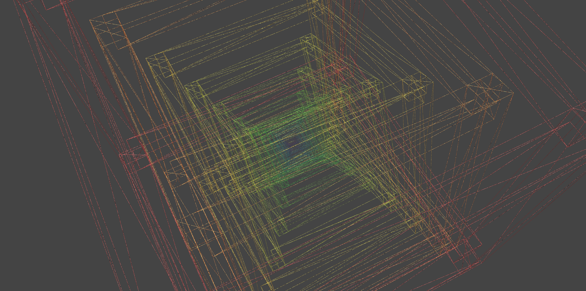

# Frames



```
/*
  @author Mikael Hvidtfeldt Christensen
*/
{ hue 0 sat 0.8 s 1.5 } r2

rule r2 maxdepth 20 {
  { s 0.75 rz 10 b 0.9 hue 20 a .8  } r2
  frame
}

rule frame {
  { s 0.1 1.1 0.1 x  5 z  5 } grid
  { s 0.1 1.1 0.1 x  5 z -5 } grid
  { s 0.1 1.1 0.1 x -5 z  5 } grid
  { s 0.1 1.1 0.1 x -5 z -5 } grid

  { s 1.0 0.1 0.1 y  5 z  5 } grid
  { s 1.0 0.1 0.1 y  5 z -5 } grid
  { s 1.0 0.1 0.1 y -5 z  5 } grid
  { s 1.0 0.1 0.1 y -5 z -5 } grid

  { s 0.1 0.1 1.0 y  5 x  5 } grid
  { s 0.1 0.1 1.0 y  5 x -5 } grid
  { s 0.1 0.1 1.0 y -5 x  5 } grid
  { s 0.1 0.1 1.0 y -5 x -5 } grid
}
```
