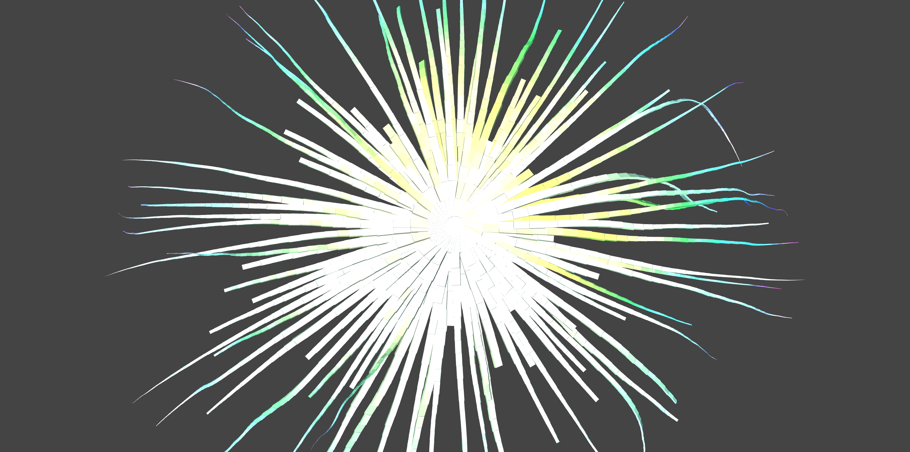
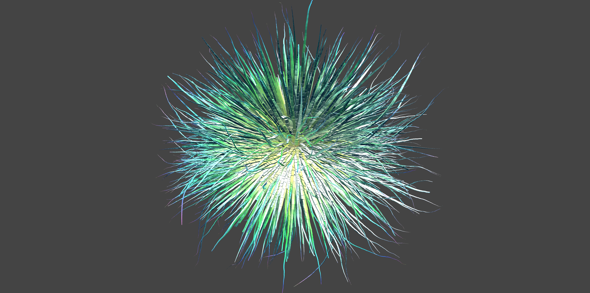

# Octopod



```
/*
  @author Mikael Hvidtfeldt Christensen
*/
set maxdepth 100

10 * { ry 36 sat 0.9 } 10 * { ry 10 } 1 * { h 30 b 0.8 sat 0.8 } r1

rule r1 w 20 {
  { s 0.9 rz 5 h 5 rx 5 x 1 } r1
  { s 1 0.2 0.5 } box
}

rule r1 w 20 {
  { s 0.99 rz -5 h 5 rx -5 x 1 } r1
  { s 1 0.2 0.5 } box
}

rule r1 {

}
```

<!-- TODO: move to leraning which is tutorial -->
If you devise above a little bit, you will get this.



```
set maxdepth 100

18 * { rx 20 } aa

rule aa {
  10 * { ry 36 sat 0.9 } 10 * { ry 10 } 1 * { h 30 b 0.8 sat 0.8 } r1
}

rule r1 w 20 {
  { s 0.9 rz 5 h 5 rx 5 x 1 } r1
  { s 1 0.2 0.5 } box
}

rule r1 w 20 {
  { s 0.99 rz -5 h 5 rx -5 x 1 } r1
  { s 1 0.2 0.5 } box
}

rule r1 {

}
```
