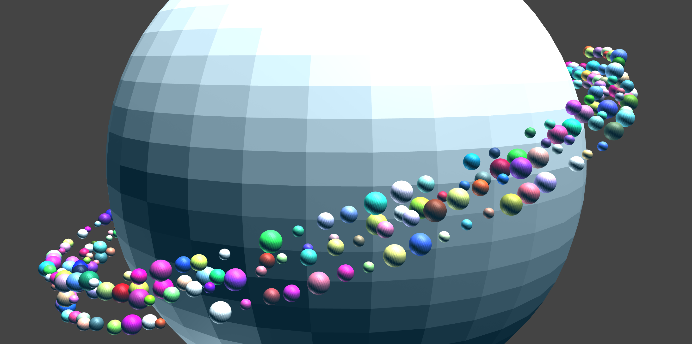

# Saturn



```
{ s 3 } saturn

rule saturn {
  1 * { y -.5 } 1 * { s 8 y 0.08  color #e0e0e0  } sphere
  1 * { y -.4 rz 20 } 36 * { ry 10 } 1 * { x 4.2 s 0.3 } R1
}

rule R1 {
  1 * { x 1 } 1 * { y 2 } 3 * { z 1 } sph
  1 * { x 2 } 3 * { y 1 } 3 * { z 1 } sph
  1 * { x 3 } 1 * { y 2 } 0 * { z 1 } sph
}

rule sph {
  { s 0.8 color random } sphere
}

rule sph {
  { s 0.6 color random  } sphere
}

rule sph {
  { s 0.4 color random  } sphere
}

rule sph {

}
```
